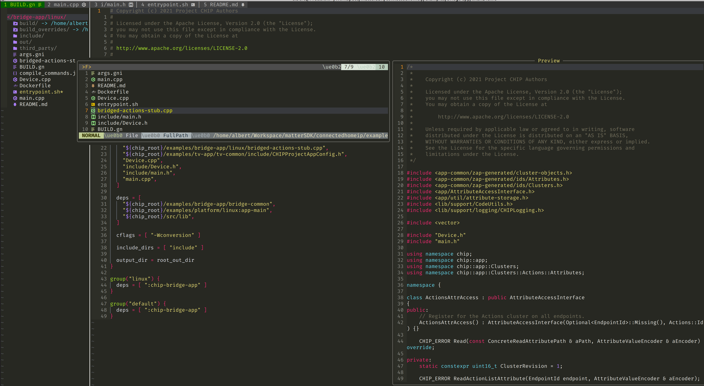
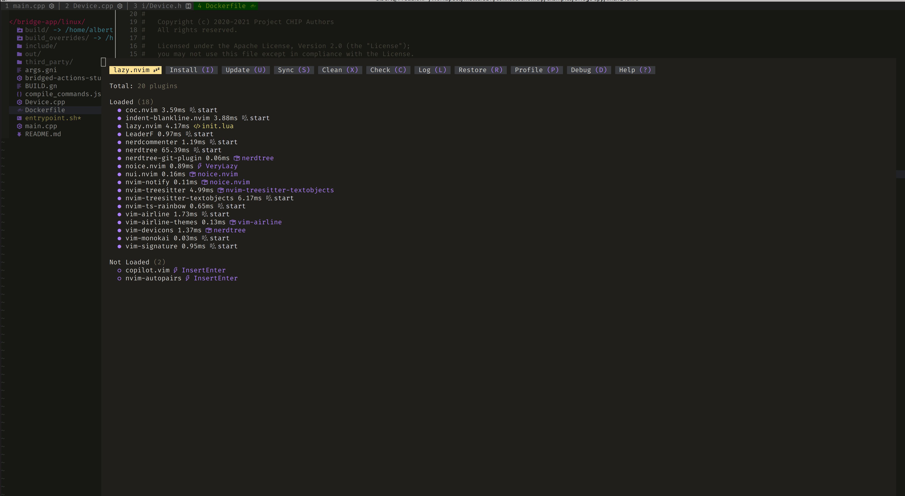
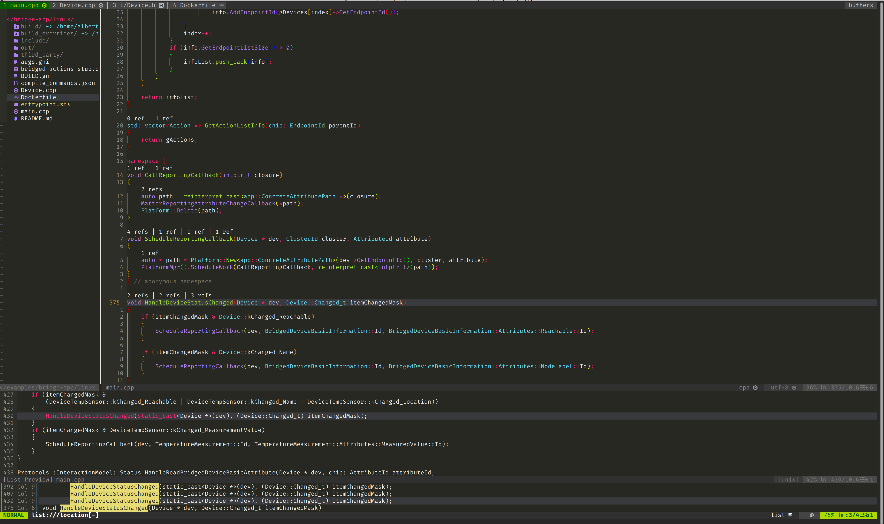

# Lua config neovim MaxIDE

---

- Developer use system: Ubuntu version greater than 22.04 LTS

## tree

```
├── coc-settings.json
├── images
│   ├── coc.png
│   ├── lazy.png
│   └── leaderf.png
├── init.lua
├── lazy-lock.json
├── lua
│   ├── colorscheme.lua
│   ├── config
│   │   ├── airline.lua
│   │   ├── indent-blankline.lua
│   │   ├── leaderf.lua
│   │   ├── nerdcommenter.lua
│   │   ├── nerdtree.lua
│   │   ├── nvim-autopairs.lua
│   │   ├── nvim-coc.lua
│   │   ├── nvim-treesitter.lua
│   │   ├── nvim-treesitter-textobjects.lua
│   │   └── nvim-ts-rainbow.lua
│   ├── keymaps.lua
│   ├── options.lua
│   └── plugins.lua
└── README.md
```

## Add Display Pictures







## Install neovim

- neovim stable version greater than 0.9.0

```bash
sudo add-apt-repository ppa:neovim-ppa/stable -y # OR sudo add-apt-repository ppa:neovim-ppa/unstable -y
sudo apt update
sudo apt-get install -y neovim
neovim --version
```

- Download neovim appimage and Install

```bash
# Select the latest version
https://github.com/neovim/neovim/releases
```

## Install nodejs

- nodejs version greater than 16.0

```bash
curl -sL https://deb.nodesource.com/setup_20.x | sudo -E bash -
sudo apt-get install -y nodejs
node --version
```

## Install npm

```bash
sudo apt-get install -y npm
sudo npm install npm@latest -g
npm -v
sudo npm install -g neovim
```

## Install yarn

```bash
curl -sS https://dl.yarnpkg.com/debian/pubkey.gpg | gpg --dearmor | sudo tee /etc/apt/trusted.gpg.d/yarnpkg-archive-keyring.gpg > /dev/null
echo "deb [signed-by=/etc/apt/trusted.gpg.d/yarnpkg-archive-keyring.gpg] https://dl.yarnpkg.com/debian/ stable main" | sudo tee /etc/apt/sources.list.d/yarn.list

sudo apt-get update
sudo apt-get install yarn
yarn --version
```

## Install python3

```bash
sudo apt-get install -y python3 python3-venv python3-dev python3-pip python3-neovim
python3 --version
pip3 install --upgrade pip
pip3 --version
pip3 install pynvim
pip3 install --upgrade pynvim
```

## Install clang and Set clang as default compiler

```bash
sudo apt-get install -y clang
clang --version
clang++ --version
```

- Set clang as default compiler

```bash
# update-alternatives --install <link> <name> <path> <priority>
sudo update-alternatives --install /usr/bin/cc cc /usr/bin/clang 100
sudo update-alternatives --install /usr/bin/c++ c++ /usr/bin/clang++ 100
```

- OR

```bash
# update-alternatives --install <link> <name> <path> <priority>
sudo update-alternatives --install /usr/bin/clang clang /usr/bin/clang-14 100
sudo update-alternatives --install /usr/bin/clang++ clang++ /usr/bin/clang++-14 100
# Switch between GCC and Clang toolchains
sudo update-alternatives --config cc
clang -v
# Switch between GCC and Clang++ toolchains
sudo update-alternatives --config c++
clang++ -v
```

### Install C/C++ language server

```bash
sudo apt-get install -y ccls
ccls --version
```

## Set terminal fonts

```bash
# download FiraCode Nerd Font
wget https://github.com/ryanoasis/nerd-fonts/releases/download/v2.1.0/FiraCode.zip

# unzip fonts
unzip FiraCode.zip -d ~/.local/share/fonts

# flush fonts cache
fc-cache -fv
```

### X-terminal set fonts

- Preferences -> Profiles -> default -> General -> Font

### System terminal set fonts

- Preferences -> Profiles -> Unnamed -> Custom font
